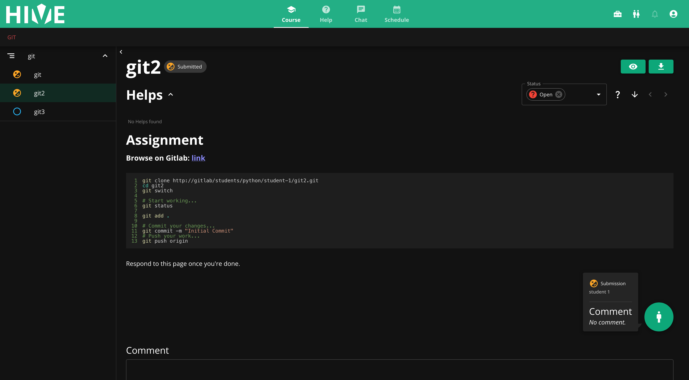
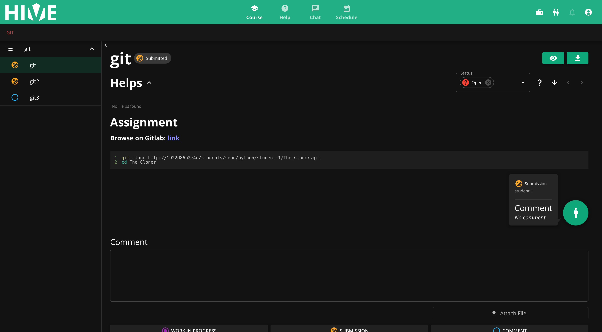

## Hive Assignment Service (Gitlab Service)

What is this?
* A service that runs an action when a task for new assignment in hive.


## Description:
* adds a description to the assigment from a template


## Gitlab:
### What happens when the service gets a gitlab request?
1. Creates a subgroup for the user (if it doesn't exist already)
2. Forks the `source_repo` and create a new repo named `new_repo_name`
3. Adds the user to the new repo
4. Removes the fork relation
5. Remove branch protection, if `work_branch_name` and `base_branch_name` are the same

### On creation data
```json
{
  "gitlab": {
    "namespace": "students/python",
    "source_repo": "templates/first-template",
    "new_repo_name": "The Cloner",
    "base_branch_name": "main",
    "work_branch_name": "work_branch_name",
    "detailed_instructions": true
  }
}
```





* With `detailed_instructions` set to `true`


